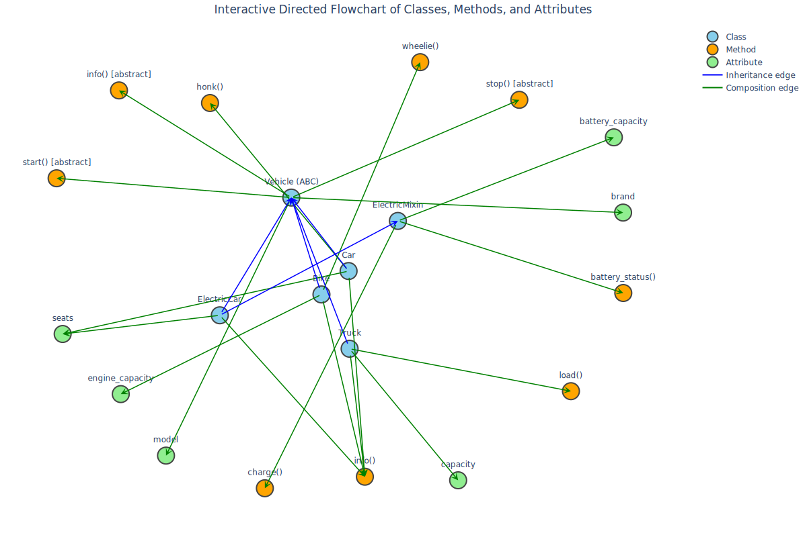

# OOP_Python
A project for improving my understanding of classes in Python.

# 🚗 Python OOP & Interactive UML Flowchart

[](https://www.python.org/)
[](LICENSE)
[](https://plotly.com/)
[](https://networkx.org/)

---

## 📌 Project Overview

This repository demonstrates:

- Object-Oriented Programming in Python with:
  - Abstract Base Classes (`ABC`)
  - Multiple inheritance (`ElectricMixin`)
  - Polymorphism and encapsulation
- Correct usage of `self` and instance attributes
- Interactive UML-style flowcharts with:
  - `networkx` (graph modeling)
  - `plotly` (interactive visualization)
- Comparison of **correct vs. incorrect** usage of `self` in Python classes

---

## 🛠️ Features

1. **Abstract Base Class**
   - `Vehicle` class defines common interface.
   - Enforces subclasses to implement `info()` method.
   
2. **Derived Classes**
   - `Car`, `Bike`, `Truck` inherit from `Vehicle`.
   - `ElectricCar` demonstrates multiple inheritance with `ElectricMixin`.
   
3. **Unique Behaviors**
   - `Car`: `honk()`
   - `Bike`: `wheelie()`
   - `Truck`: `load()`
   - `ElectricCar`: `charge()` and `battery_status()`
   
4. **Interactive Flowchart**
   - Visualizes class hierarchy, attributes, and methods.
   - Inheritance edges in **blue**, composition edges in **green**.
   - Clustered rectangles for each class.

---

## 📝 Usage

1. **Run Python classes:**

```python
from vehicle_classes import Car, Bike, Truck, ElectricCar

vehicles = [
    Car("Toyota", "Camry", 5),
    Bike("Yamaha", "R15", 150),
    Truck("Volvo", "FH16", 20),
    ElectricCar("Tesla", "Model 3", 5, 75)
]

for v in vehicles:
    print(v.start())
    print(v.info())
    print(v.stop())
```

2. **View unique behaviors:**

```python
print(vehicles[0].honk())
print(vehicles[1].wheelie())
print(vehicles[2].load())
print(vehicles[3].charge(20))
print(vehicles[3].battery_status())
```

3. **🧩 Why self Matters**

Every Python object instance stores its own data.

self is required to access instance attributes and methods.

Missing self leads to errors (demonstrated by BadCar vs GoodCar examples).

4. **📚 Concepts Covered**

- Abstract Base Classes (ABC)
- Multiple Inheritance
- Polymorphism
- Encapsulation
- Instance identity (id(self))
- Graph-based visualization with NetworkX & Plotly

5. **Flowchart**


